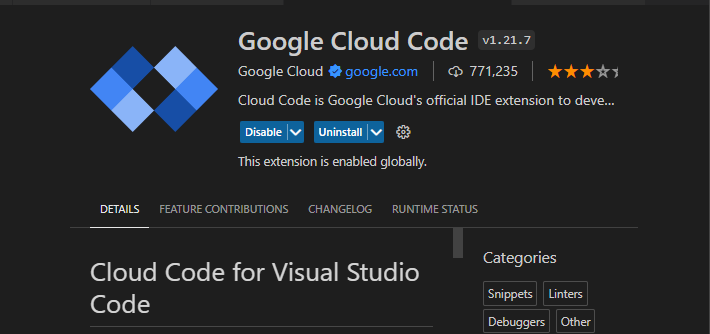
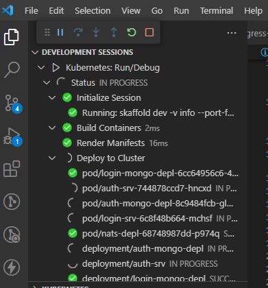

# API
Api with 2 microservices modules: Login &amp; Auth to register, login and list users.

Login module:
- Register new user
- Login user already registered
- Return JWT after login

Auth module:
- Access will be only through an specific route and JWT will be required. To achive this fetature, created a proxy to only allowd access from mentioned route.
- To achive events communications, it was neccesary to containerize the application with skaffold and used NATS for messaging communications of the events.
- Database: MongoDB.

## Requirements

| Plugin | README |
| ------ | ------ |
| Docker Desktop | https://www.docker.com/products/docker-desktop/ |
| Cloud Code  | Available as VSCode extension |

To run the project:
### Step 1
```
git clone https://github.com/FerCappelletti/API.git
cd API
code .
```

### Step 2
Once the project is open on your IDE and Cloude Code extension is installed



### Step 3
Open Docker Desktop application 

### Step 4
Back to VSCode and open the Command Palette (press Ctrl/Cmd+Shift+P or click View > Command Palette) and then "Run on Kubernetes".


### Step 5
Deployment process starting




